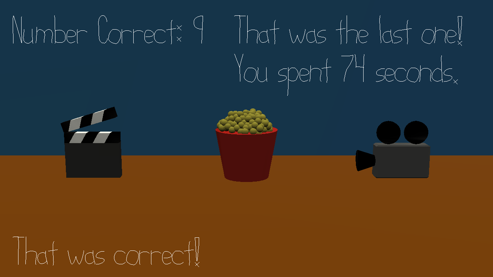

# Movie Trivia

Author: David Lyons

Design: Can you guess the movie from me acting out a scene? And can you figure out which letter is featured
most prominently in the title before time runs out?

Screen Shot:

How To Play:

I have recorded myself acting out scenes from 10 movies. Your goal is to figure out each movie and deduce whether
there are more "R"s or "L"s in the title. If there are more Rs, hit the right arrow key. If there are more Ls, hit
the left arrow key. If the number of each is the same, hit either the up or down arrow key. Making a selection will
advance to the next round. You have 30 seconds per round. Your current score will be shown in the upper left corner,
and the result of your guess will be shown on the bottom. After the last movie, a message in the upper right will tell
you that the game is over. If you're still stumped after the game ends, answers.txt has the list of movies (and the scenes).
A timer after round 10 will tell you how long it took so that you can compete with your friends. In addition, to make it 
visually more fun, I have three objects on the screen corresponding to each choice. The one you choose will do a little hop. 
To stop you from speeding through and force you to actually listen to some of each recording, no choices will register during 
a hop. Wait until it lands to hit your next guess.

This game was built with [NEST](NEST.md).
